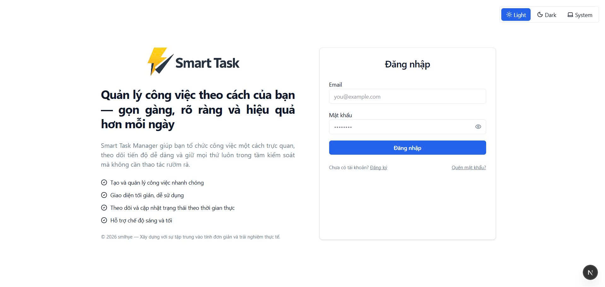
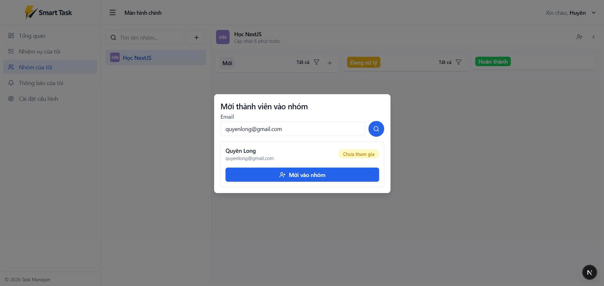
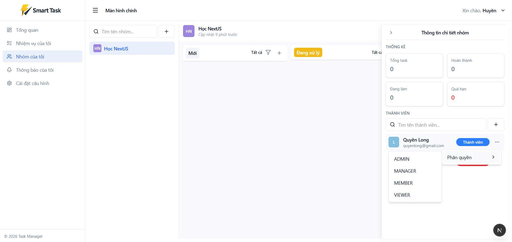
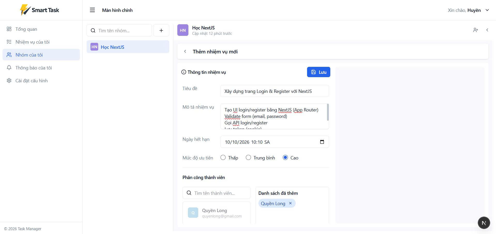
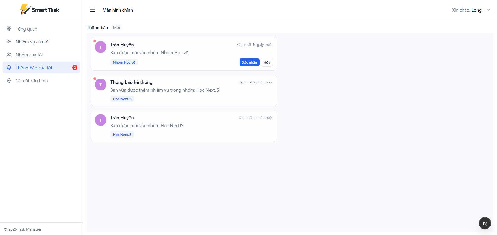
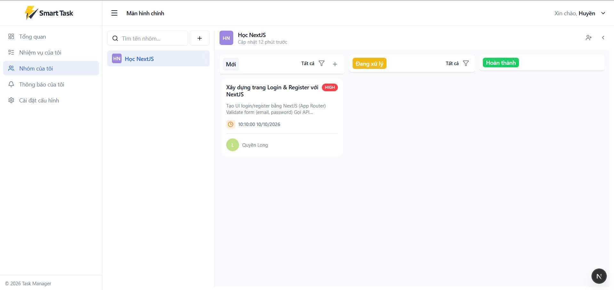
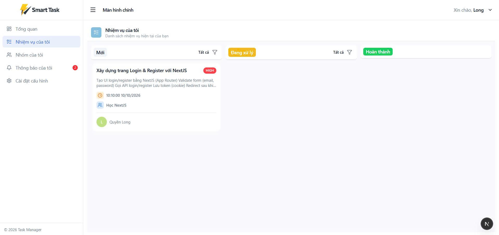
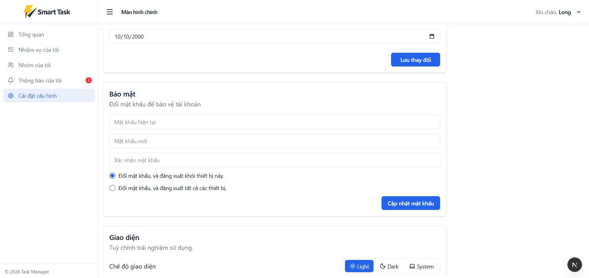

# Smart Task Management System v1

**Smart Task Management System** là hệ thống quản lý công việc theo nhóm được xây dựng theo kiến trúc full-stack hiện đại, hỗ trợ tổ chức, theo dõi và cộng tác xử lý công việc một cách hiệu quả.

Hệ thống cung cấp các chức năng cốt lõi:

- Quản lý nhóm và phân quyền (Admin, Manager, Member, Viewer)
- Quản lý vòng đời công việc (CRUD, assign, tracking)
- Thông báo realtime qua WebSocket
- Xác thực bảo mật với JWT và OTP (lưu trữ tạm thời bằng Redis)
- Tối ưu hiệu năng với caching và query optimization

Ứng dụng được thiết kế theo hướng **scalable**, đảm bảo **tính nhất quán dữ liệu** và **hiệu năng cao**, phù hợp cho cá nhân và các nhóm làm việc quy mô nhỏ đến trung bình.

---

## 1. Tổng quan hệ thống

Hệ thống được xây dựng theo kiến trúc full-stack, gồm các thành phần chính:

- **Frontend (NextJS)**: Xây dựng giao diện người dùng và quản lý state phía client (React Query)
- **Backend (NestJS)**: Cung cấp API, xử lý logic nghiệp vụ và xác thực
- **Database (MySQL)**: Lưu trữ dữ liệu chính
- **Cache (Redis + React Query)**:
  - Redis: cache phía server, lưu trữ dữ liệu tạm (OTP, caching)
  - React Query: cache phía client, tối ưu fetch và đồng bộ state

---

## 2. Chức năng chính

### 2.1. Xác thực & người dùng

- Đăng ký / đăng nhập (JWT)
- Hỗ trợ đăng nhập nhiều thiết bị thông qua cơ chế quản lý session với refresh token
- Lưu trữ refresh token theo từng phiên đăng nhập, hỗ trợ revoke toàn bộ session khi logout
- Quên mật khẩu qua email (OTP)

#### Bảo mật & kiểm soát OTP

- Lưu trữ OTP bằng Redis với TTL (tự động hết hạn)
- Giới hạn số lần gửi OTP, chặn gửi lại trong vòng 1 giờ nếu vượt ngưỡng
- Giới hạn số lần nhập sai OTP (tối đa 5 lần), khóa xác thực trong 1 giờ
- Áp dụng rate limiting (NestJS) để ngăn spam và brute-force attack

---

### 2.2. Quản lý nhóm

- Tạo, cập nhật, xóa, tìm kiếm nhóm làm việc
- Gửi lời mời tham gia nhóm thông qua thông báo realtime (WebSocket), cho phép người dùng nhận và xem trực tiếp trên ứng dụng
- Quản lý danh sách thành viên trong nhóm, phân quyền
- Phân công nhiệm vụ giữa các thành viên

#### Phân quyền (Role-based Access Control)

| Role    | Quyền |
|---------|------|
| Admin   | Toàn quyền quản lý, phân quyền nhóm và thành viên |
| Manager | Quản lý và phân công công việc |
| Member  | Xem và thực hiện các nhiệm vụ được giao |
| Viewer  | Xem thông tin nhóm các nhiệm vụ |

---

### 2.3. Quản lý công việc

- Tạo, cập nhật và xóa công việc (CRUD)
- Gán công việc cho thành viên trong nhóm
- Thông báo realtime (WebSocket) khi có công việc mới được giao, giúp thành viên theo dõi nhiệm vụ kịp thời
- Lọc công việc theo trạng thái: còn hạn / hết hạn
- Phân loại công việc rõ ràng:
  - Công việc mới
  - Đang thực hiện
  - Đã hoàn thành
- Tải dữ liệu theo cơ chế infinite scroll (React Query - useInfiniteQuery) để tối ưu trải nghiệm người dùng

---

### 2.4. Realtime

- Sử dụng WebSocket để xử lý thông báo theo thời gian thực
- Cập nhật dữ liệu ngay lập tức giữa các client

#### Thông báo bao gồm:

- Nhận công việc mới được giao
- Nhận lời mời tham gia nhóm

---

## 3. Công nghệ sử dụng

### Frontend

- NextJS: Xây dựng giao diện và routing phía client
- React Hooks: Quản lý state và lifecycle
- React Query: Fetching, caching và đồng bộ dữ liệu
- Axios: Gọi API và xử lý HTTP request/response
- React Hook Form: Quản lý form hiệu quả
- Zod: Validate dữ liệu đầu vào

---

### Backend

- NestJS: Xây dựng API theo kiến trúc module, dễ mở rộng
- RESTful API: Thiết kế các endpoint theo chuẩn REST
- JWT Authentication: Xác thực và phân quyền người dùng
- WebSocket: Xử lý realtime notification
- Swagger (OpenAPI): Tài liệu hóa API, hỗ trợ test và mô tả endpoint rõ ràng

---

### Database & Cache

- MySQL: Lưu trữ dữ liệu chính
- Prisma ORM: Tương tác database và quản lý schema
- Redis: Lưu trữ dữ liệu tạm (OTP)

---

## 4. Thiết kế hệ thống

### Database

- Thiết kế theo mô hình quan hệ (Relational Database)
- Chuẩn hóa dữ liệu, đảm bảo tính nhất quán
- Tối ưu truy vấn với JOIN và indexing

---

### API

- Thiết kế theo chuẩn RESTful
- Tổ chức theo kiến trúc module rõ ràng:
  - Auth: Xác thực và phân quyền
  - Mail: Gửi email OTP xác thực
  - Notification: Xử lý realtime notification (WebSocket)
  - User: Quản lý người dùng
  - Group: Quản lý nhóm và thành viên
  - Task: Quản lý công việc

---

### Data Handling

- Sử dụng React Query để:
  - Cache dữ liệu phía client
  - Đồng bộ state giữa các component
  - Giảm số lần gọi API và tối ưu hiệu năng

---

## 5. Tối ưu hiệu năng

- Sử dụng React Query để cache dữ liệu phía client, giảm số lần gọi API và cải thiện trải nghiệm người dùng
- Áp dụng Redis để lưu trữ dữ liệu tạm (OTP), giảm tải cho hệ thống backend
- Tối ưu truy vấn database bằng JOIN và indexing
- Sử dụng debounce khi xử lý input tìm kiếm, hạn chế request không cần thiết
- Tải dữ liệu theo cơ chế infinite scroll (useInfiniteQuery) để tối ưu hiệu năng và UX

---

## 6. Cấu trúc thư mục

```bash
project/
├── backend/
│   ├── src/
│   │   ├── modules/
│   │   │   ├── auth/
│   │   │   ├── group/
│   │   │   ├── mail/
│   │   │   ├── notification/
│   │   │   ├── redis/
│   │   │   ├── task/
│   │   │   ├── user/
│   │   │
│   │   ├── common/
│   │   │   ├── errors/
│   │   │   ├── filters/
│   │   │   ├── interceptors/
│   │   │   ├── schemas/
│   │   │   ├── type/
│   │   │   └── utils/
│   │   │
│   │   ├── config/
│   │   ├── templates/
│   │   ├── websocket/
│   │   │
│   │   ├── prisma/
│   │   ├── app.module.ts/
│   │   └── main.ts
│
├── frontend/
│   ├── app/
│   │   ├── (auth)/
│   │   ├── (dashboard)/
│   │   ├── lib/
│   │   ├── modules/
│   │   │   ├── auth/
│   │   │   ├── dashboard/
│   │   │   ├── group/
│   │   │   ├── notification/
│   │   │   ├── settings/
│   │   │   ├── tasks/
│   │   │   ├── users/
│   │   │
│   │   └── shared/
│   │   │   ├── components/
│   │   │   ├── contants/
│   │   │   ├── hooks/
│   │   │   ├── provider/
│   │   │   ├── types/
│   │   │   ├── utils/
```

---

## 7. Chuẩn bị môi trường

### Yêu cầu cài đặt:

- NodeJS >= 20
- MySQL
- Redis
- Git

---

### Các dịch vụ cần chạy

- **MySQL**: Lưu trữ dữ liệu chính của hệ thống
- **Redis**: Lưu trữ dữ liệu tạm (OTP, rate limiting)

---

### Khuyến nghị

- Sử dụng Docker để chạy MySQL và Redis nhằm đảm bảo môi trường đồng nhất
- Sử dụng Prisma CLI để quản lý schema và migration database

---

## 7. Screenshots

## LOGIN

<p align="center">
  
</p>

## Task

<p align="center">
  
  
</p>

<p align="center">
  
  
</p>

<p align="center">
  
  
</p>

## Settings
<p align="center">
  
</p>
